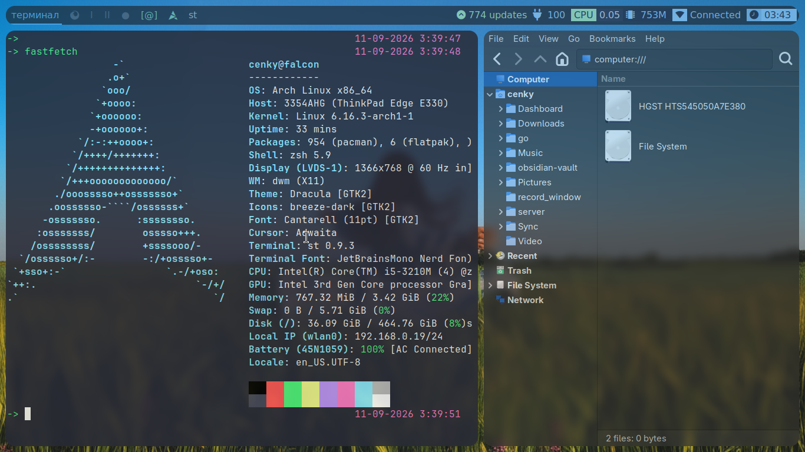

# dwm setup

My X11 desktop: a [chadwm](https://github.com/siduck/chadwm) build of dwm, with
patched `st` and `dmenu`, a dash status bar and rofi.



Running on a 2012 ThinkPad Edge E330 — 1366x768, i5-3210M, 3.4 GB RAM. The whole
session idles around 750 MB.

Archived here so the configuration survives the machine it grew on. Everything is
compiled from source — the `config.h` files *are* the configuration.

```
chadwm/
  chadwm/     window manager source + config.h, themes/
  scripts/    bar.sh status bar, bar_themes/
  rofi/       launcher config + themes/
dmenu/        patched dmenu
st/           patched terminal
bg.png        wallpaper
```

## Keys

`Mod` is the **Super** (Windows) key.

### Windows

| Keys | Action |
|---|---|
| `Mod` + `Return` | Open terminal (`st`) |
| `Mod` + `C` | Application launcher (`rofi -show drun`) |
| `Mod` + `Q` | Close window |
| `Mod` + `J` / `K` | Focus next / previous |
| `Mod` + `Shift` + `J` / `K` | Move window down / up the stack |
| `Mod` + `Shift` + `Return` | Promote window to master |
| `Mod` + `F` | Fullscreen |
| **`Mod` + `Shift` + `Space`** | **Toggle floating on the focused window** |
| `Mod` + `E` | Hide window |
| `Mod` + `Shift` + `E` | Restore hidden window |
| `Mod` + `Tab` | Back to previous tag |

### Layouts

| Keys | Layout |
|---|---|
| `Mod` + `T` | Tile `[]=` (default) |
| `Mod` + `Shift` + `F` | Monocle `[M]` |
| `Mod` + `M` | Spiral `[@]` |
| `Mod` + `Ctrl` + `G` | Gapless grid `:::` |
| **`Mod` + `Ctrl` + `Shift` + `T`** | **Floating layout `><>` — everything floats** |
| `Mod` + `Space` | Reset to default layout |
| `Mod` + `Ctrl` + `,` / `.` | Cycle layouts backward / forward |

Fourteen layouts are compiled in; the keys above bind the five most used. The rest
are reachable by cycling. Clicking the layout symbol in the bar also switches.

### Sizing

| Keys | Action |
|---|---|
| `Mod` + `H` / `L` | Shrink / grow the master area |
| `Mod` + `Shift` + `H` / `L` | Grow / shrink the focused window |
| `Mod` + `Shift` + `O` | Reset window size |
| `Mod` + `I` / `D` | More / fewer windows in master |
| `Mod` + `Shift` + `P` / `-` | Thicker / thinner borders |
| `Mod` + `Shift` + `W` | Reset border width |

### Gaps

| Keys | Action |
|---|---|
| `Mod` + `Ctrl` + `T` | Toggle gaps |
| `Mod` + `Ctrl` + `I` / `D` | All gaps bigger / smaller |
| `Mod` + `Ctrl` + `Shift` + `D` | Reset gaps |
| `Mod` + `Shift` + `I` | Inner gaps bigger |
| `Mod` + `Ctrl` + `O` | Outer gaps bigger |
| `Mod` + `Ctrl` + `6` … `9` | Inner/outer, horizontal/vertical gaps individually |

Add `Shift` to any of the gap keys to decrease instead of increase.

### Tags and monitors

| Keys | Action |
|---|---|
| `Mod` + `1`…`9` | Switch to tag |
| `Mod` + `Shift` + `1`…`9` | Move window to tag |
| `Mod` + `0` | Show all tags |
| `Mod` + `Left` / `Right` | Previous / next tag |
| `Mod` + `,` / `.` | Focus previous / next monitor |
| `Mod` + `Shift` + `,` / `.` | Move window to previous / next monitor |

### Screenshots and recording

| Keys | Action |
|---|---|
| `Mod` + `U` | Select a region → `~/Pictures/Screenshots/` |
| `Mod` + `Ctrl` + `U` | Whole screen → `~/Pictures/Screenshots/` |
| `Ctrl` + `PrtSc` | Flameshot editor, saves **and copies to clipboard** |
| `Mod` + `Ctrl` + `R` | Start window recording |
| `Mod` + `Ctrl` + `S` | Stop recording |

### Misc

| Keys | Action |
|---|---|
| `Mod` + `V` | Clipboard history (`clipmenu`) |
| `Mod` + `B` | Toggle the bar |
| `Mod` + `Ctrl` + `W` | Toggle tab mode |
| `Mod` + `Shift` + `R` | Restart the window manager |
| `Mod` + `Ctrl` + `Q` | Quit to the login shell |

### Mouse

| Action | Result |
|---|---|
| `Mod` + drag left | Move window |
| `Mod` + drag right | Resize window |
| **`Mod` + middle click** | **Toggle floating** |
| `Ctrl` + drag left | Drag the master/stack split |
| `Ctrl` + drag right | Resize within the stack |
| Click layout symbol | Switch layout |
| Click tag | View tag · right click toggles it |

## Two ways to float

Worth spelling out because they behave differently:

- **`Mod` + `Shift` + `Space`** floats only the focused window; everything else stays
  tiled. This is what you want most of the time.
- **`Mod` + `Ctrl` + `Shift` + `T`** switches the whole layout to floating, so every
  window on the tag behaves like a traditional desktop.

Some windows float automatically — the rules live near the top of `config.h`.

## Building

Each component builds independently:

```bash
cd chadwm/chadwm && sudo make install clean
cd dmenu         && sudo make install clean
cd st            && sudo make install clean
```

Binaries land in `/usr/local/bin`. They are deliberately not committed — edit
`config.h` and rebuild.

Before building, adjust the two recording-script paths in
`chadwm/chadwm/config.h` (marked with a comment) to your own home directory.

## Session startup

Started from `~/.xinitrc` with `startx`, roughly:

```sh
sxhkd &
xrdb merge ~/.Xresources &
feh --bg-fill bg.png
picom &
dash scripts/bar.sh &
udiskie &
exec chadwm
```

### Dependencies

`xorg-server` `xorg-xinit` `xorg-xsetroot` · `sxhkd` `picom` `feh` `udiskie` `dash`
`rofi` `clipmenu` · `maim` `scrot` `flameshot` `xclip`

Fonts: Iosevka, JetBrainsMono Nerd Font.

## Themes

Bar themes in `chadwm/scripts/bar_themes/`, window manager colours in
`chadwm/chadwm/themes/` (catppuccin, dracula, gruvchad, nord, onedark, tokyonight),
rofi themes in `chadwm/rofi/themes/`.

## Credit

dwm, st and dmenu are [suckless](https://suckless.org) projects, MIT licensed.
chadwm is [siduck's](https://github.com/siduck/chadwm) fork. Original licenses are
kept in place. What is mine here is the configuration and the patch selection.
